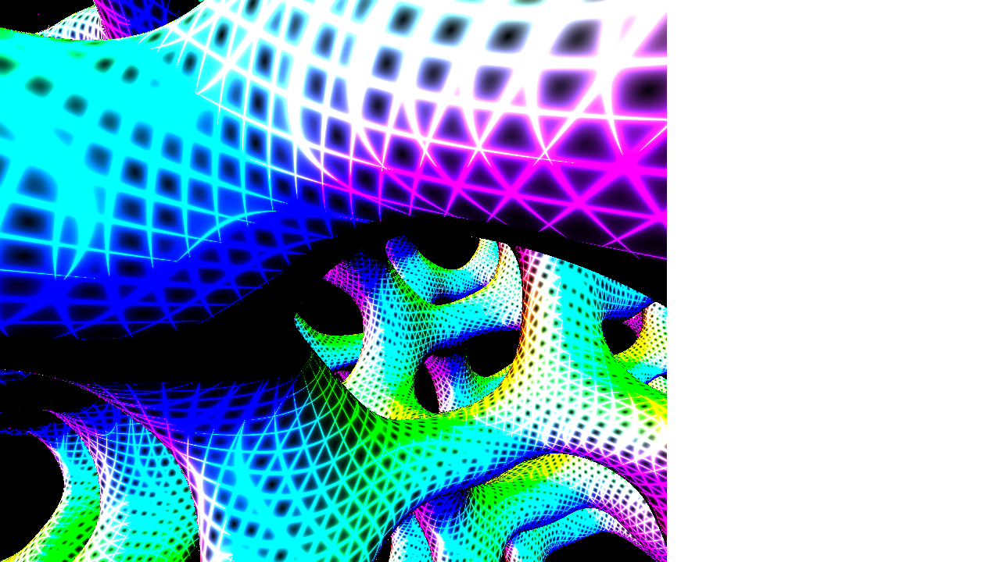

# sikistys 1k js framework 
This is 1k js framework supporting one fragment shader and byte beat. Included is tähtituho's lovebyte 2023 entry [sikistys](https://www.pouet.net/prod.php?which=93677)

## Prerequisites
1. *install node*
1. *run npm install -g http-server*
1. *npm install node-zopfli*
1. *npm install terser*

## Shader development
Custom build of [Leviathan 2.0](https://github.com/armak/Leviathan-2.0) is included for your convenience. Leviathan is great tool to write shaders, because it is really simple and aims to be productive. Custom build differs from orignal in following ways:
1. You don't need to divide _t_ variable at all. It is compatible with time variable from js.
1. It does not support post processing

Use you favorite editor to write shader. Visual Studio Code with [GLSL lint](https://marketplace.visualstudio.com/items?itemName=dtoplak.vscode-glsllint) is recommended.
1. Edit *shader.frag*
1. Run *tools/leviatha-custom-build.exe*
1. Leviathan will reload shader when you save shader in your editor

## Testing with browser
When you feel like shader is ready to be executed in browser, do following steps:
1. Minify shader by running *startBrowser.ps1*.
1. Click somewhere in upper left segment of browser to start
This should open new browser tab to address http://localhost:8080/index.html

## Writing byte beat
Find _onclick_-function in *main.js* and there you will se comment saying "write tune here". Paste your byte beat into that. NOTICE your byte beat might need some tweaking if you wrote in it https://greggman.com/downloads/examples/html5bytebeat/html5bytebeat.html. Start *http-server* like you did with shader and listen to your tune.

## Making release
When you feel that shader and byte beat are good as they get, you should do release.
1. Run *makeRelease.ps1*
1. Start *http-server* and try results at http://localhost:8080/release/index.html
1. Submit entry to you favorite party with instruction how to run and start demo.

## Shoutouts
[Leviathan 2.0](https://github.com/armak/Leviathan-2.0) For awesome shader editor

[Shader_Minifier](https://github.com/laurentlb/Shader_Minifier) For minifying shader

[Terser](https://github.com/terser/terser) For minifying js

[compeko](https://gist.github.com/0b5vr/09ee96ca2efbe5bf9d64dad7220e923b) For PNG compression

